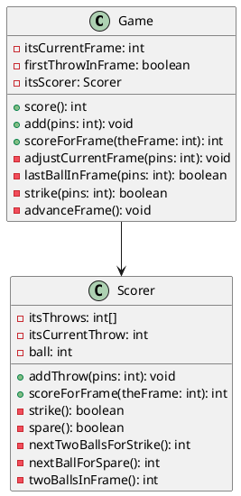
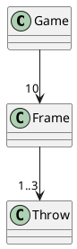
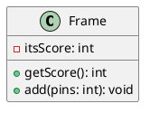
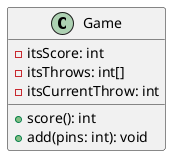
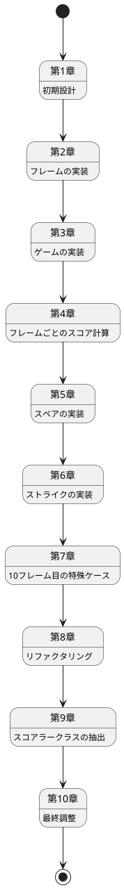

# ボウリングゲームの実装 - テスト駆動開発アプローチ

## はじめに

このドキュメントでは、ボウリングゲームのスコア計算プログラムの実装プロセスを解説します。実装は **テスト駆動開発（TDD）** の手法に従って行われ、各ステップごとに段階的に機能を追加していきました。

このドキュメントを読むことで、テスト駆動開発の流れを理解し、ボウリングゲームのスコア計算プログラムを自分で実装できるようになることを目指しています。

### 最終的なクラス構造



## 目次

1. [第1章: 初期設計](#第1章-初期設計)
2. [第2章: フレームの実装](#第2章-フレームの実装)
3. [第3章: ゲームの実装](#第3章-ゲームの実装)
4. [第4章: フレームごとのスコア計算](#第4章-フレームごとのスコア計算)
5. [第5章: スペアの実装](#第5章-スペアの実装)
6. [第6章: ストライクの実装](#第6章-ストライクの実装)
7. [第7章: 10フレーム目の特殊ケース](#第7章-10フレーム目の特殊ケース)
8. [第8章: リファクタリング](#第8章-リファクタリング)
9. [第9章: スコアラークラスの抽出](#第9章-スコアラークラスの抽出)
10. [第10章: 最終調整](#第10章-最終調整)

## 第1章: 初期設計

### 目標
- ボウリングゲームのドメインモデルを設計する
- プロジェクトの初期設定を行う

### クラス図



### 実装手順

1. まず、ボウリングゲームのドメインモデルを設計します。ボウリングゲームは10フレームで構成され、各フレームには1〜3投があります。

2. プロジェクトの初期設定を行います。Gradleを使用してプロジェクトをセットアップします。

```gradle
group 'com.k2works'
version '1.0-SNAPSHOT'

apply plugin: 'java'

sourceCompatibility = 1.5

repositories {
    mavenCentral()
}

dependencies {
    testCompile group: 'junit', name: 'junit', version: '4.11'
}
```

3. 最初のテストクラスを作成します。

```java
import junit.framework.TestCase;

public class TestThrow extends TestCase {
    public TestThrow(String name)
    {
        super(name);
    }
    // public void test???
}
```

### 振り返り
- ドメインモデルを設計することで、実装の方向性が明確になりました。
- テスト駆動開発の準備として、テストクラスを作成しました。
- この段階では具体的なテストはまだ書いていませんが、次の章で実装を進めていきます。

## 第2章: フレームの実装

### 目標
- フレームクラスの基本機能を実装する
- テスト駆動開発のサイクルを実践する

### クラス図



### 実装手順

1. フレームのテストクラスを作成します。

```java
import junit.framework.TestCase;

public class TestFrame extends TestCase {
    public TestFrame(String name)
    {
        super(name);
    }
    
    public void testScoreNoThrows()
    {
        Frame f = new Frame();
        assertEquals(0, f.getScore());
    }
}
```

2. テストを実行すると、`Frame`クラスが存在しないためコンパイルエラーになります。そこで、最小限の`Frame`クラスを作成します。

```java
public class Frame {
    public int getScore()
    {
        return 0;
    }
}
```

3. 次に、投球を追加するテストを書きます。

```java
public void testAddOneThrow()
{
    Frame f = new Frame();
    f.add(5);
    assertEquals(5, f.getScore());
}
```

4. テストを通すために、`add`メソッドを実装します。

```java
public class Frame {
    private int itsScore = 0;
    
    public int getScore()
    {
        return itsScore;
    }
    
    public void add(int pins)
    {
        itsScore += pins;
    }
}
```

### 振り返り
- テスト駆動開発のサイクル（テストを書く→テストが失敗する→最小限の実装でテストを通す）を実践しました。
- フレームクラスの基本機能（スコアの取得と投球の追加）を実装しました。
- この段階では、スペアやストライクの処理はまだ実装していません。

## 第3章: ゲームの実装

### 目標
- ゲームクラスの基本機能を実装する
- 複数の投球を管理する機能を追加する

### クラス図



### 実装手順

1. ゲームのテストクラスを作成します。

```java
import junit.framework.TestCase;

public class TestGame extends TestCase {
    public TestGame(String name)
    {
        super(name);
    }
    
    public void testOneThrow()
    {
        Game g = new Game();
        g.add(5);
        assertEquals(5, g.score());
    }
}
```

2. テストを実行すると、`Game`クラスが存在しないためコンパイルエラーになります。そこで、最小限の`Game`クラスを作成します。

```java
public class Game {
    public int score()
    {
        return 0;
    }
    
    public void add(int pins)
    {
    }
}
```

3. テストを通すために、`Game`クラスを実装します。

```java
public class Game {
    private int itsScore = 0;
    
    public int score()
    {
        return itsScore;
    }
    
    public void add(int pins)
    {
        itsScore += pins;
    }
}
```

4. 次に、複数の投球を管理するテストを追加します。

```java
public void testTwoThrowsNoMark()
{
    Game g = new Game();
    g.add(5);
    g.add(4);
    assertEquals(9, g.score());
}
```

5. テストが成功するようになりました。次に、投球を配列で管理するように実装を変更します。

```java
public class Game {
    private int itsScore = 0;
    private int[] itsThrows = new int[21];
    private int itsCurrentThrow = 0;
    
    public int score()
    {
        return itsScore;
    }
    
    public void add(int pins)
    {
        itsThrows[itsCurrentThrow++] = pins;
        itsScore += pins;
    }
}
```

### 振り返り
- ゲームクラスの基本機能（スコアの計算と投球の追加）を実装しました。
- 投球を配列で管理することで、後でスペアやストライクの計算ができるようになります。
- この段階では、フレームごとのスコア計算はまだ実装していません。

## 第4章: フレームごとのスコア計算

### 目標
- フレームごとのスコア計算機能を追加する
- 現在のフレーム番号を管理する機能を追加する

### 実装手順

1. フレームごとのスコア計算をテストするコードを追加します。

```java
public void testFourThrowsNoMark()
{
    Game g = new Game();
    g.add(5);
    g.add(4);
    g.add(7);
    g.add(2);
    assertEquals(18, g.score());
    assertEquals(9, g.scoreForFrame(1));
    assertEquals(18, g.scoreForFrame(2));
}
```

2. テストを実行すると、`scoreForFrame`メソッドが存在しないためコンパイルエラーになります。そこで、`scoreForFrame`メソッドを実装します。

```java
public int scoreForFrame(int frame)
{
    int score = 0;
    for (int ball = 0;
         frame > 0 && (ball < itsCurrentThrow);
         ball += 2, frame--)
    {
        score += itsThrows[ball] + itsThrows[ball+1];
    }
    return score;
}
```

3. 次に、現在のフレーム番号を管理するテストを追加します。

```java
public void testOneThrow()
{
    Game g = new Game();
    g.add(5);
    assertEquals(5, g.score());
    assertEquals(1, g.getCurrentFrame());
}
```

4. テストを実行すると、`getCurrentFrame`メソッドが存在しないためコンパイルエラーになります。そこで、`getCurrentFrame`メソッドを実装します。

```java
public int getCurrentFrame()
{
    return 1;
}
```

5. より正確なフレーム番号の計算を実装します。

```java
public int getCurrentFrame()
{
    return 1 + (itsCurrentThrow - 1) / 2;
}
```

6. フレーム番号の管理をさらに改善します。

```java
private int itsCurrentFrame = 1;
private boolean firstThrow = true;

public void add(int pins)
{
    itsThrows[itsCurrentThrow++] = pins;
    itsScore += pins;
    adjustCurrentFrame();
}

private void adjustCurrentFrame()
{
    if (firstThrow == true)
    {
        firstThrow = false;
    }
    else
    {
        firstThrow = true;
        itsCurrentFrame++;
    }
}
```

### 振り返り
- フレームごとのスコア計算機能を追加しました。
- 現在のフレーム番号を管理する機能を追加しました。
- 投球ごとにフレーム番号を適切に更新する仕組みを実装しました。

## 第5章: スペアの実装

### 目標
- スペアの得点計算を実装する
- スペアの後のフレームのスコア計算を正確に行う

### 実装手順

1. スペアのテストを追加します。

```java
public void testSimpleSpare()
{
    Game g = new Game();
    g.add(3);
    g.add(7);
    g.add(3);
    assertEquals(13, g.scoreForFrame(1));
}
```

2. テストを通すために、`scoreForFrame`メソッドを修正します。

```java
public int scoreForFrame(int theFrame)
{
    int ball = 0;
    int score = 0;
    for (int currentFrame = 0;
         currentFrame < theFrame;
         currentFrame++)
    {
        int firstThrow = itsThrows[ball++];
        int secondThrow = itsThrows[ball++];
        int frameScore = firstThrow + secondThrow;
        
        // スペアの得点計算には次のフレームの第１投が必要
        if (frameScore == 10)
            score += frameScore + itsThrows[ball];
        else
            score += frameScore;
    }
    
    return score;
}
```

3. スペアの後のフレームのテストを追加します。

```java
public void testSimpleFrameAfterSpare()
{
    Game g = new Game();
    g.add(3);
    g.add(7);
    g.add(3);
    g.add(2);
    assertEquals(13, g.scoreForFrame(1));
    assertEquals(18, g.score());
}
```

4. テストが成功するようになりました。

### 振り返り
- スペアの得点計算を実装しました。スペアの場合、次のフレームの最初の投球の得点を加算します。
- スペアの後のフレームのスコア計算も正確に行えるようになりました。
- この段階では、ストライクの処理はまだ実装していません。

## 第6章: ストライクの実装

### 目標
- ストライクの得点計算を実装する
- ストライクの後のフレームのスコア計算を正確に行う

### 実装手順

1. ストライクのテストを追加します。

```java
public void testSimpleStrike()
{
    Game g = new Game();
    g.add(10);
    g.add(3);
    g.add(6);
    assertEquals(19, g.scoreForFrame(1));
    assertEquals(28, g.score());
}
```

2. テストを通すために、`scoreForFrame`メソッドを修正します。

```java
public int scoreForFrame(int theFrame)
{
    int ball = 0;
    int score = 0;
    for (int currentFrame = 0;
         currentFrame < theFrame;
         currentFrame++)
    {
        int firstThrow = itsThrows[ball++];
        if (firstThrow == 10)
        {
            score += 10 + itsThrows[ball] + itsThrows[ball+1];
        }
        else
        {
            int secondThrow = itsThrows[ball++];
            int frameScore = firstThrow + secondThrow;
            // スペアの得点計算には次のフレームの第１投が必要
            if (frameScore == 10)
                score += frameScore + itsThrows[ball];
            else
                score += frameScore;
        }
    }
    
    return score;
}
```

3. ストライクの場合のフレーム管理も修正します。

```java
private void adjustCurrentFrame(int pins)
{
    if (firstThrow == true)
    {
        if (pins == 10) // ストライク
            itsCurrentFrame++;
        else
            firstThrow = false;
    }
    else
    {
        firstThrow = true;
        itsCurrentFrame++;
    }
}
```

### 振り返り
- ストライクの得点計算を実装しました。ストライクの場合、次の2投の得点を加算します。
- ストライクの場合のフレーム管理も適切に行えるようになりました。
- この段階では、10フレーム目の特殊ケースはまだ考慮していません。

## 第7章: 10フレーム目の特殊ケース

### 目標
- 10フレーム目のストライクとスペアの特殊ケースを実装する
- パーフェクトゲーム（300点）のテストを追加する

### 実装手順

1. パーフェクトゲームのテストを追加します。

```java
public void testPerfectGame()
{
    Game g = new Game();
    for (int i = 0; i < 12; i++)
    {
        g.add(10);
    }
    assertEquals(300, g.score());
}
```

2. 10フレーム目の制限を調整します。

```java
private void advanceFrame()
{
    itsCurrentFrame = Math.min(11, itsCurrentFrame + 1);
}
```

3. 10フレーム目のスペアのテストを追加します。

```java
public void testTenthFrameSpare()
{
    Game g = new Game();
    for (int i = 0; i < 9; i++)
        g.add(10);
    g.add(9);
    g.add(1);
    g.add(1);
    assertEquals(270, g.score());
}
```

4. 「ハートブレイク」（最後の1投だけ9ピン）のテストを追加します。

```java
public void testHeartBreak()
{
    Game g = new Game();
    for (int i = 0; i < 11; i++)
        g.add(10);
    g.add(9);
    assertEquals(299, g.score());
}
```

### 振り返り
- 10フレーム目のストライクとスペアの特殊ケースを実装しました。
- パーフェクトゲーム（300点）のテストを追加し、正しく計算できることを確認しました。
- 様々なケースのテストを追加することで、スコア計算の正確性を確保しました。

## 第8章: リファクタリング

### 目標
- コードの可読性と保守性を向上させる
- メソッドの抽出と名前の改善

### 実装手順

1. ストライク判定のメソッドを抽出します。

```java
private boolean strike()
{
    return itsThrows[ball] == 10;
}
```

2. ストライク後の2投の得点計算メソッドを抽出します。

```java
private int nextTwoBallsForStrike()
{
    return itsThrows[ball+1] + itsThrows[ball+2];
}
```

3. スペア判定のメソッドを抽出します。

```java
private boolean spare()
{
    return (itsThrows[ball] + itsThrows[ball+1]) == 10;
}
```

4. スペア後の1投の得点計算メソッドを抽出します。

```java
private int nextBallForSpare()
{
    return itsThrows[ball+2];
}
```

5. フレーム内の2投の得点計算メソッドを抽出します。

```java
private int twoBallsInFrame()
{
    return itsThrows[ball] + itsThrows[ball+1];
}
```

6. フレーム管理のメソッドをリファクタリングします。

```java
private void adjustCurrentFrame(int pins)
{
    if (lastBallInFrame(pins))
        advanceFrame();
    else
        firstThrowInFrame = false;
}

private boolean lastBallInFrame(int pins)
{
    return strike(pins) || !firstThrowInFrame;
}

private boolean strike(int pins)
{
    return (firstThrowInFrame && pins == 10);
}

private void advanceFrame()
{
    itsCurrentFrame = Math.min(10, itsCurrentFrame + 1);
    firstThrowInFrame = true;
}
```

### 振り返り
- メソッドの抽出により、コードの可読性が向上しました。
- 名前の改善により、コードの意図が明確になりました。
- リファクタリングにより、コードの保守性が向上しました。

## 第9章: スコアラークラスの抽出

### 目標
- スコア計算ロジックを別クラスに抽出する
- 責任の分離を行う

### クラス図


### 実装手順

1. `Scorer`クラスを作成し、スコア計算ロジックを移動します。

```java
public class Scorer {
    private int[] itsThrows = new int[21];
    private int itsCurrentThrow = 0;
    private int ball;
    
    public void addThrow(int pins)
    {
        itsThrows[itsCurrentThrow++] = pins;
    }
    
    public int scoreForFrame(int theFrame)
    {
        ball = 0;
        int score = 0;
        for (int currentFrame = 0;
             currentFrame < theFrame;
             currentFrame++)
        {
            if (strike())
            {
                score += 10 + nextTwoBallsForStrike();
                ball++;
            }
            else if (spare())
            {
                score += 10 + nextBallForSpare();
                ball += 2;
            }
            else
            {
                score += twoBallsInFrame();
                ball += 2;
            }
        }
        return score;
    }
    
    private boolean strike()
    {
        return itsThrows[ball] == 10;
    }
    
    private boolean spare()
    {
        return (itsThrows[ball] + itsThrows[ball+1]) == 10;
    }
    
    private int nextTwoBallsForStrike()
    {
        return itsThrows[ball+1] + itsThrows[ball+2];
    }
    
    private int nextBallForSpare()
    {
        return itsThrows[ball+2];
    }
    
    private int twoBallsInFrame()
    {
        return itsThrows[ball] + itsThrows[ball+1];
    }
}
```

2. `Game`クラスを修正して、`Scorer`クラスを使用するようにします。

```java
public class Game {
    private int itsCurrentFrame = 1;
    private boolean firstThrowInFrame = true;
    private Scorer itsScorer = new Scorer();
    
    public int score()
    {
        return scoreForFrame(itsCurrentFrame);
    }
    
    public void add(int pins)
    {
        itsScorer.addThrow(pins);
        adjustCurrentFrame(pins);
    }
    
    private void adjustCurrentFrame(int pins)
    {
        if (lastBallInFrame(pins))
            advanceFrame();
        else
            firstThrowInFrame = false;
    }
    
    private boolean lastBallInFrame(int pins)
    {
        return strike(pins) || !firstThrowInFrame;
    }
    
    private boolean strike(int pins)
    {
        return (firstThrowInFrame && pins == 10);
    }
    
    private void advanceFrame()
    {
        itsCurrentFrame = Math.min(10, itsCurrentFrame + 1);
        firstThrowInFrame = true;
    }
    
    public int scoreForFrame(int theFrame)
    {
        return itsScorer.scoreForFrame(theFrame);
    }
}
```

### 振り返り
- スコア計算ロジックを`Scorer`クラスに抽出することで、責任の分離ができました。
- `Game`クラスはフレーム管理に集中し、`Scorer`クラスはスコア計算に集中できるようになりました。
- 単一責任の原則に従ったクラス設計になりました。

## 第10章: 最終調整

### 目標
- 不要なコードの削除
- 最終的なクラス構造の確認

### 実装手順

1. 不要になった`Frame`クラスと`TestFrame`クラスを削除します。

2. 不要になった`TestThrow`クラスを削除します。

3. 最終的なクラス構造を確認します。


### 振り返り
- 不要なコードを削除することで、コードベースがシンプルになりました。
- 最終的なクラス構造は、責任が明確に分離されたシンプルな設計になりました。
- テスト駆動開発により、堅牢で保守性の高いコードが実現できました。

## まとめ

このドキュメントでは、テスト駆動開発の手法を用いて、ボウリングゲームのスコア計算プログラムを段階的に実装していく過程を解説しました。各章ごとに目標を設定し、テストを先に書いてから実装を進めるというTDDのサイクルを繰り返すことで、堅牢で柔軟なシステムを構築することができました。

### システム進化のステートチャート



主な成果は以下の通りです：

1. テスト駆動開発のサイクルを実践し、堅牢なコードを実現
2. 責任の分離による保守性の高い設計
3. リファクタリングによる可読性の向上
4. ボウリングのルールを正確に実装したスコア計算システム

テスト駆動開発は、小さな歩幅で着実に前進することで、複雑な問題を解決する強力な手法です。このドキュメントが、テスト駆動開発とボウリングゲームのスコア計算システムの実装の理解の助けになれば幸いです。